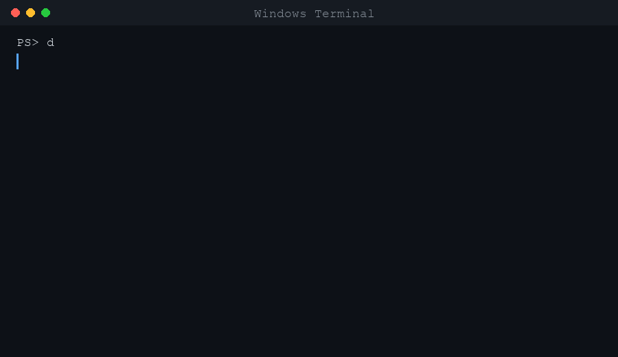

# DevReady

**Готов ли ваш Windows к разработке? Одна команда — и вы знаете.**

На базе **HomeBase DevShell** — локальная проверка здоровья PowerShell 7 на Windows. Без облака. Без admin. Без угадываний.

🌍 [English](README.md) · **Русский**

[](https://github.com/XKush/homebase-devshell/actions/workflows/ci.yml)
[](LICENSE)
[](https://aka.ms/powershell)



**Проверьте до запуска:** [`install.ps1` @ v2.2.1](https://github.com/XKush/homebase-devshell/blob/v2.2.1/install.ps1) · `devshell init` (dry-run) · [zip + SHA256](packaging/README.md)

---

## Старт за 30 секунд

```powershell
irm https://raw.githubusercontent.com/XKush/homebase-devshell/v2.2.1/install.ps1 | iex
```

Закройте терминал. Откройте снова:

```powershell
devready
```

Видите **`Ready to work`**? Можно работать. Иначе — блок **Try this** в выводе, затем снова `devready`.

<details>
<summary>Три команды (на старте достаточно)</summary>

| Команда | Когда |
|---------|--------|
| **`devready`** | Ежедневная проверка |
| **`devshell install`** | Первая настройка (Core) |
| **`devshell doctor`** | То же; `-Tier Full` для полного стека |

</details>

<details>
<summary>После PASS — command center</summary>

Меню и кокпит: [docs/ru/COMMAND-CENTER.md](docs/ru/COMMAND-CENTER.md) — не обязательны для Core.

</details>

---

## Зачем

| Боль | Ответ DevReady |
|------|----------------|
| Сломанный PATH, профиль, git — тихо до ночи | **`devready`** за секунды |
| Новый ПК | Одна строка install, одна проверка |
| Перед первым коммитом | Зелёное = можно. Нет — чиним |

Всё **только на вашем ПК**.

---

## Команды

| Команда | Действие |
|---------|----------|
| **`devready`** | Проверка → **Ready to work** или подсказки |
| **`devshell install`** | Core (профиль, папки); `-WithTools` — winget-стек |
| **`devshell doctor`** | Как devready; `-Tier Full` — ~75 проверок |

---

## Документация

| Файл | О чём |
|------|--------|
| [Старт](docs/GETTING-STARTED.md) | Пути, диаграмма |
| [Проблемы](docs/TROUBLESHOOTING.md) | Если doctor падает |
| [Command center](docs/ru/COMMAND-CENTER.md) | `go`, `home`, меню |
| [Бренд](docs/product/BRAND.md) | DevReady vs HomeBase |

Карта репозитория: [REPOSITORY-SURFACE.md](docs/product/REPOSITORY-SURFACE.md)

---

## Безопасно

- Установка **без admin** по умолчанию  
- **`install` можно повторять**  
- Tor/PGP — **opt-in** через `sec`, не нужны для Core  

---

## Не для вас, если

- Нужен macOS/Linux  
- Нужен недельный курс перед использованием  

---

[CONTRIBUTING.md](CONTRIBUTING.md) · [SECURITY.md](SECURITY.md)

**Поделиться:** `irm …/install.ps1 | iex` → **`devready`**

[⭐ Star](https://github.com/XKush/homebase-devshell)
