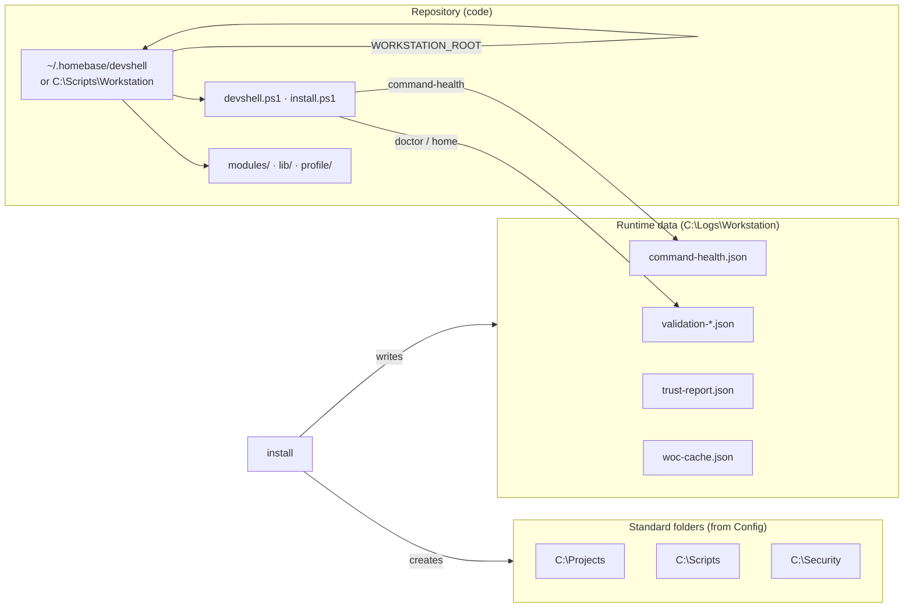

# Getting started — DevReady

1. **Install** (one line):

```powershell
irm https://raw.githubusercontent.com/XKush/homebase-devshell/v2.1.1/install.ps1 | iex
```

2. **Close and reopen** your terminal  
3. **Run** `devready` — look for `Ready to work`

That's the whole flow. Default install runs **Core** doctor (pwsh, git, profile, module, command-health). For the full workstation checklist:

```powershell
devshell doctor -Tier Full
```

## Where things live

HomeBase uses two path layers: the **git checkout** (code) and **runtime data** (logs, caches, trust scores).



| Path | Purpose |
|------|---------|
| `WORKSTATION_ROOT` / `~/.homebase/devshell` | Clone of this repo — commands, profile source, modules |
| `C:\Logs\Workstation` | Doctor reports, command-health, trust, WOC cache |
| `C:\Projects`, `C:\Scripts`, `C:\Security`, … | Work folders (created on install) |

Set `WORKSTATION_LANG=ru` if you prefer Russian cockpit text (default for OSS is `en`).

**Not ready?** [Troubleshooting](TROUBLESHOOTING.md)
